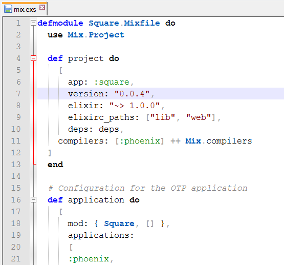

Elixir syntax highlighting for Notepad++
========================================

I'm trying to implement a usefull but simple custom Elixir syntax 
highlighting for Notepad++.

And this is how it looks like:

TODOs
-----

* sigils (at least regex)
* probably more

You are welcome to submit issues for any problems you encounter or missing features.